# CardioLens — Educational ML Demo
### A Responsible Machine-Learning Case Study on Historical Heart-Disease Research Data

> **Not medical advice.** Every figure is a *model score on historical public research data* — not a medical verdict and not a clinical tool. Generated June 2026. Companion to `CardioLens_Project_Dossier.pdf` (the premium, fully-designed version).

---

## Contents
**Part I — Overview:** 1 Executive summary · 2 Project identity · 3 What it is / is not
**Part II — The science:** 4 Scientific overview · 5 ML pipeline map · 6 Model selection & internal results · 7 External validation · 8 Calibration vs discrimination · 9 Operating thresholds
**Part III — The website:** 10 Architecture · 11 Page-by-page · 12 /try deep dive · 13 Model-based explanation
**Part IV — Design:** 14 Design system · 15 Why these choices
**Part V — Responsibility & engineering:** 16 Safety & wording · 17 Privacy · 18 Engineering decisions
**Part VI — Process & roadmap:** 19 Workflow & phases · 20 Current state · 21 Roadmap · 22 Responsible-use statement
**Appendix:** A Metric source map · B Diagram sources

---

# Part I — Overview

## 1 · Executive summary
CardioLens turns a finished, **frozen** heart-disease machine-learning study into a premium, readable public case study — built to show evaluation done **honestly**, limitations and all.

The project has two halves. A reproducible ML study on the UCI Cleveland dataset (a calibrated Random Forest that estimates a model probability for the research label), and a public website (Next.js + FastAPI) that presents the same frozen numbers honestly.

| Internal ROC-AUC | External cohorts | Calibration (Brier) |
|---|---|---|
| **0.892** (held-out, n=61) | **3** (never trained on) | **0.137** internal → up to 0.339 external |

- **Problem it demonstrates** — a model can *rank* cases well yet be *poorly calibrated*; that gap widens on unseen data.
- **Why educational only** — small (61 held-out), single-centre, decades-old data; no prospective or clinical validation.
- **What the web app adds** — a live page to score one research-style input pattern, charts of the real evaluation, and a full transparency section.
- **What it is not** — not a diagnosis tool, not a medical device, not clinically validated, not medical advice. It stores nothing you enter.

## 2 · Project identity
A **lens** is an instrument you look *through* to see something more clearly — it has a focus, a limit, and an edge beyond which it blurs. That is the honest framing: a frozen model presented as a calibrated instrument for reading research data, not a device that judges a person.

| Element | Decision |
|---|---|
| Name | **CardioLens** — instrument identity |
| Tagline | *A calibrated lens on heart-disease research data.* |
| Tone | Calm, exact, premium, research-oriented |
| Avoided | Medical-product cues (crosses, alarm reds, "diagnosis", "patient") that imply a clinical claim `[docs/design/brand.md]` |

## 3 · What it is — and is not
**Can:** show how one frozen model scores research-style inputs · explain which inputs moved a score (within the model) · demonstrate that performance drops on unseen cohorts · make a real ML evaluation readable.
**Cannot:** make any claim about a real person's health · give medical advice · promise its probabilities hold outside this research data · replace a qualified clinician.

> **If you are worried about your heart.** This is an educational demo, not medical advice. If you have symptoms or concerns, contact a qualified clinician or your local emergency number. `[docs/design/copy.md · /about]`

---

# Part II — The science

## 4 · Scientific overview
| Aspect | Detail | Source |
|---|---|---|
| Dataset | UCI Cleveland Heart Disease (DOI 10.24432/C52P4X) | data_card |
| Size | 303 raw → 302 de-duplicated; 45.7% positive | data_card |
| Features | 13 routine clinical features + target | data_card |
| Target fix | label inversion corrected (heart_disease = 1 − target) | data/README |
| Model | calibrated Random Forest (isotonic), selected by 5-fold CV | model_card |
| Framing | educational / portfolio; no clinical claim | model_card |

The model artifact, metrics, reports, and data are **frozen**; the website only reads them. The model-file hash is verified unchanged across every build phase.

## 5 · Machine-learning pipeline map
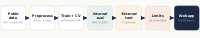
*Figure 1 — Public research data → preprocess → train + CV → internal evaluation → external validation → limitations → educational web app.*

Stage by stage: **Data** (UCI Cleveland to train; Hungarian/VA/Switzerland held out) → **Preprocess** (de-dup, target-fix, encoding harmonisation via `src/schema.py`) → **Train + CV** (stratified 5-fold; threshold later chosen on out-of-fold data — no leakage) → **Internal evaluation** (discrimination, calibration, bootstrap, nested CV, decision curve, error analysis, learning curve) → **External validation** (deployed model, unchanged) → **Limitations** (documented) → **Web app** (presents, never recomputes).

## 6 · Model selection & internal results
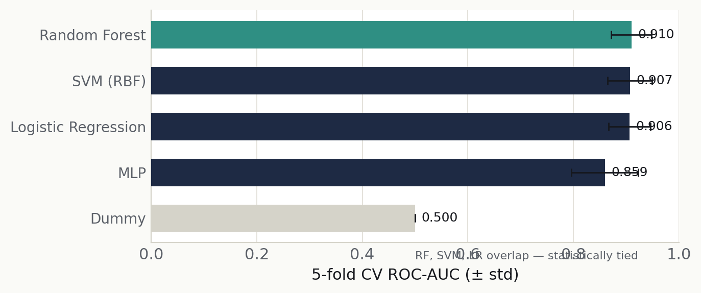
*Figure 2 — 5-fold CV ROC-AUC (± std). RF, SVM and LR overlap — statistically tied. `[reports/cv_results.json]`*

| Model | CV ROC-AUC | CV recall |
|---|---:|---:|
| Random Forest | 0.910 ± 0.038 | 0.809 |
| SVM (RBF) | 0.907 ± 0.042 | 0.818 |
| Logistic Regression | 0.906 ± 0.040 | 0.800 |
| MLP | 0.859 ± 0.063 | 0.773 |
| Dummy (baseline) | 0.500 | 0.000 |

Random Forest was chosen on top mean AUC, but an interpretable **Logistic Regression would be an equally defensible** choice on data this size.

**Held-out test (default threshold 0.50, n=61):** ROC-AUC **0.892** · PR-AUC 0.853 · sensitivity 0.714 · specificity 0.848 · F1 0.755 · Brier 0.137.
**Confusion:** TP 20 · FN 8 · TN 28 · FP 5.

> **Honesty first.** With 61 test rows, intervals are wide: ROC-AUC 0.892 [0.805, 0.961]; sensitivity 0.714 [0.542, 0.879]; specificity 0.849 [0.710, 0.964]. Treat the CV ranges as more reliable than any single test number. `[reports/uncertainty_metrics.json · model_card.md]`

*Exploratory subgroup OOF ROC-AUC:* Overall 0.903 · Female 0.922 · Male 0.875 · Age<55 0.934 · Age≥55 0.856 — wide intervals, not a fairness verdict. `[reports/subgroup_metrics.csv]`

## 7 · External validation — the stress test
The deployed model, trained only on Cleveland, was applied unchanged to three independent UCI cohorts. **Discrimination partially transfers; calibration does not.**

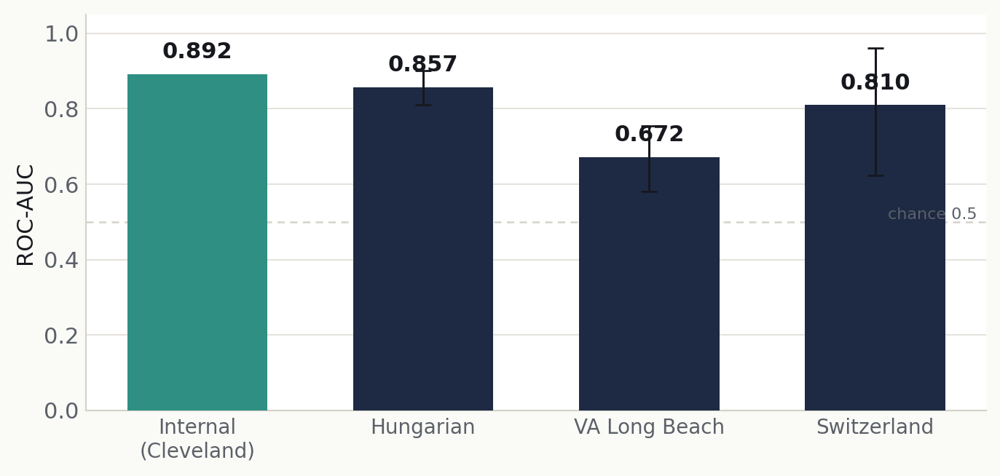
*Figure 3 — ROC-AUC by cohort with 95% bootstrap intervals. `[reports/external_validation_metrics.csv]`*

| Cohort | n | Disease rate | ROC-AUC | Brier | ca missing | thal missing |
|---|---:|---:|---:|---:|---:|---:|
| Cleveland (internal) | 61 | 0.46 | 0.892 | 0.137 | — | — |
| Hungarian | 294 | 0.36 | 0.857 | 0.178 | 99% | 90% |
| VA Long Beach | 200 | 0.74 | 0.672 | 0.339 | 99% | 83% |
| Switzerland | 123 | 0.94 | 0.810 | 0.337 | 96% | 42% |

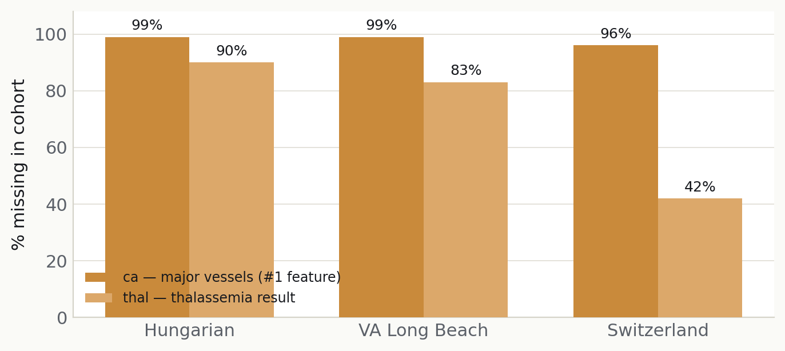
*Figure 4 — The model's strongest features are barely recorded externally: ca 96–99% missing, thal 42–90% missing.*

- Ranking partly survives (Hungarian 0.857 ≈ internal).
- **VA Long Beach is weakest** (0.672) — its disease rate (0.74) and population differ most, and its strong features are almost entirely missing.
- Calibration breaks everywhere (Brier 0.137 internal → 0.178–0.339 external).
- Root cause — ca/thal imputed with Cleveland's mode; base rates differ widely.

> **Honest conclusion.** The model would need external recalibration/retraining before any use elsewhere.

## 8 · Calibration vs discrimination
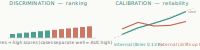
*Figure 5 — Discrimination asks whether higher-scoring cases really are more often positive (ROC-AUC). Calibration asks whether a 0.7 happens ~70% of the time (Brier / reliability).*

- **ROC-AUC 0.892** — ranking is strong; says nothing about whether the numbers are accurate.
- **Brier 0.137** — decent internally, climbs sharply externally; the scores stop meaning what they say.

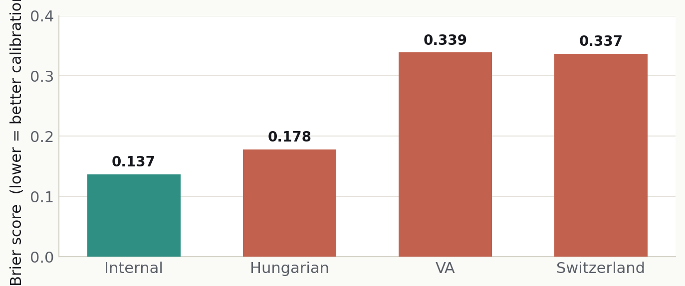
*Figure 6 — Brier rises on every external cohort. Good ranking can hide bad calibration — the project's central lesson.*

## 9 · Operating thresholds
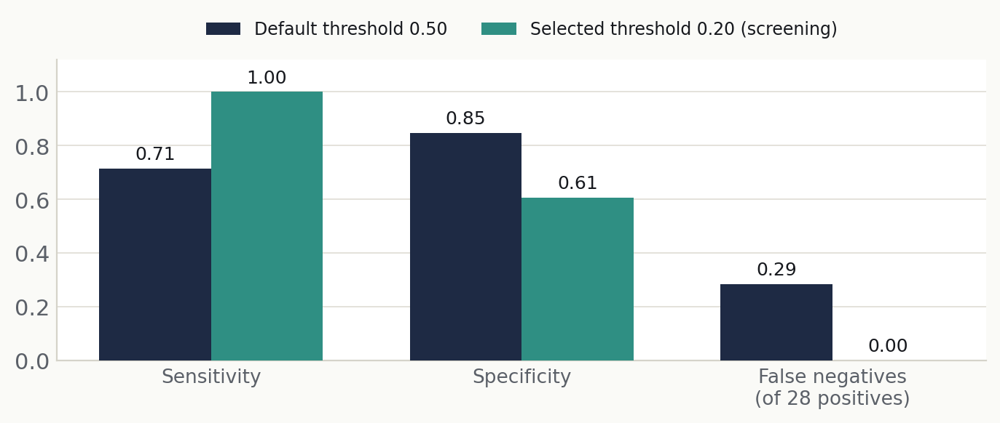
*Figure 7 — The same frozen model at two operating points.*

| Operating point | Sensitivity | Specificity | TP | FP | TN | FN |
|---|---:|---:|---:|---:|---:|---:|
| Default · 0.50 | 0.714 | 0.848 | 20 | 5 | 28 | 8 |
| Selected · 0.20 (screening) | 1.000 | 0.606 | 28 | 13 | 20 | 0 |

`[reports/threshold_test_evaluation.csv]` The 0.20 threshold was tuned on out-of-fold data (missed case weighted 5× a false alarm), then evaluated once on the held-out test. It is the only place sensitivity 1.00 appears — shown with its wide-interval caveat. **A low score is a below-threshold model result, never an "all-clear".**

---

# Part III — The website

## 10 · Website architecture
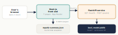
*Figure 8 — Six pages are static (from a committed reports-summary.json snapshot); only /try calls the FastAPI /predict endpoint, which loads the frozen model.*

| Choice | Why |
|---|---|
| Next.js (App Router) | Premium UX, routing, static generation, one client island for /try |
| Existing FastAPI | Reuses the additive /predict endpoint; no new ML code |
| No Streamlit | A public site needs real routing, design control, performance |
| No database | Nothing needs to persist; storing health-style inputs is a privacy risk |
| No auth | No accounts, no gated content |
| No analytics of inputs | Inputs are scored and forgotten |
| No Docker / CI / MLflow (v1) | Out of scope; science already reproducible |
| No heavy 3D (v1) | Performance and clarity; the one bold device is the SVG gauge |

**Additive-only backend:** the only change was adding within-model explanation factors to /predict plus a CORS allow-list. No endpoint, metric, or model byte altered. `[api/main.py]`

## 11 · Page-by-page tour
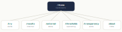
*Figure 9 — Home anchors six sections; the disclaimer and identical nav/footer appear on every page.*

| Page | Purpose | Safety framing |
|---|---|---|
| `/` | Thesis + three-beat story + honest stats | Persistent disclaimer; ROC-AUC leads; sens/spec labelled with threshold |
| `/try` | Score one research-style input pattern live | Model score, not a verdict; inputs not stored |
| `/results` | Internal metrics, confusion, honest empty-states | Small-sample caveats; no fabricated curves |
| `/external` | The stress test across 3 cohorts | Retrospective educational validation only |
| `/thresholds` | Operating-point trade-off | Screening-oriented, not clinical; sens 1.00 with caveat |
| `/transparency` | Model card + data card in full | Renders the frozen cards faithfully; no new claims |
| `/about` | Can/cannot, privacy, when to seek real help | Directs to a clinician for any real concern |

> *Note on screenshots:* live browser screenshots could not be captured in the build environment (no headless browser binary available, and none could be downloaded). Page visuals in the PDF are **faithful layout previews reconstructed from the live build's copy and design tokens** — clearly labelled as such.

## 12 · The /try page — deep dive
- **Stateless** — input sent to compute a score, then forgotten. No account, no database, no analytics of inputs.
- **Honest framing** — "model-estimated probability on research data", a neutral above/below-threshold band (no pass/fail colour), fixed magnitude caption.
- **Two-sided explanation** — top inputs that pushed the score up and down, each with a directional label so colour is never the only signal.
- **Robust states** — labelled inputs with valid ranges; inline + summary validation; calm copy for backend-asleep, server error, and timeout.
- Coded fields are labelled dropdowns from the dataset's own documented encodings — never invented clinical category names. `[frontend/src/components/try · src/schema.py]`

The score gauge teal→amber→coral encodes **magnitude of the model score only** — never a health verdict; coral is deliberately calm, not alarm red.

## 13 · Model-based explanation

*Figure 10 — For a record, the deployed model produces a score; marginal contributions rank which inputs moved it up (coral) or down (teal). Reuses `src/patient_report.py` — no new explanation maths.*

- **Within-model only** — describes how this model's score responded to these inputs vs a cohort baseline.
- **Not causal** — we never say a feature "caused heart disease".
- **Approximate** — saturated 0/1 scores flatten contributions, which is why the high preset is tuned to ~0.75 so both sides stay visible.

---

# Part IV — Design

## 14 · The design system
One source of truth — `tokens.css` / `tokens.ts`.
**Palette (light):** base #FAFAF7 · surface #FFFFFF · ink #16181D · primary #1E2A44 · teal #2F8F83 · teal-text #277A6F · amber #C98A3B · coral #C2614E · hairline #E4E2DA. Amber/coral are reserved for the score-gauge scale only. Dark mode defined alongside (base #0E1117, ink #E8EAED, teal #46A89B…).
**Type:** Newsreader (display serif) · Hanken Grotesk (body) · IBM Plex Mono (data/labels).
**Other:** 4px spacing base · subtle radii (4–16px) · restrained motion with `prefers-reduced-motion` honoured · WCAG AA both themes (teal text #277A6F clears 4.5:1), visible focus, ≥44px targets, colour never the only signal, charts have text alternatives. `[docs/design/tokens.css · components.md]`

## 15 · Why these design choices
| Choice | Reason |
|---|---|
| Warm ivory, not hospital white | Calm, editorial; avoids the clinical, anxious feel |
| Deep navy-indigo primary | Trust and seriousness without coldness |
| Teal for interaction | One confident accent |
| Amber/coral, not alarm red | Encodes score *magnitude*; warm, never frightening |
| No green=healthy / red=sick | Those semantics imply a verdict the project never makes |
| Static SVG lattice, not heavy 3D | Premium and fast; the lens motif as a calm backdrop |
| Instrument, not app | Tick scales, mono readouts, measured spacing |

---

# Part V — Responsibility & engineering

## 16 · Safety & wording guardrails
**Words we use:** model score · model-estimated probability on research data · educational ML demo · model-based explanation · above/below threshold · not causal · not medical advice · retrospective educational validation.
**Words we never render:** diagnosis · disease probability (as truth) · sick · healthy · "you have heart disease" · "you are safe" · clinically validated · medical-grade · patient positive/negative.

| Instead of… | We say… | Why |
|---|---|---|
| disease probability | model score | names the source (a model), not a truth about a body |
| positive / negative | above / below threshold | a threshold is a choice, not a diagnosis |
| you are safe | below the threshold | a low score is never an all-clear |
| clinically validated | retrospective educational validation | states exactly what was (and was not) done |

*Figure 11 — Five layers, from the frozen science outward to the human who deploys and reviews each phase.* The brand voice and a build-time scan enforce the same rule twice. `[AGENTS.md · CLAUDE.md]`

## 17 · Privacy & data handling
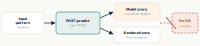
*Figure 12 — An input pattern is sent over HTTPS to /predict, scored and explained, rendered once, and forgotten.*

No persistence · no accounts/profiles · no tracking of inputs · no cookies on medical inputs. Health-style inputs are sensitive; not storing them removes an entire class of risk and is the right default for a public educational tool.

## 18 · Engineering decisions & trade-offs
| Decision | Rationale |
|---|---|
| Frozen folders protected | src / models / reports / data / notebooks / tests never modified |
| Additive-only API | new response fields + CORS only |
| Static pages + JSON snapshot | six of seven pages need no server |
| No retraining / recompute | every number read verbatim; model hash verified each phase |
| No Streamlit / database / auth | premium UX needed; removes privacy & security surface |
| No deployment secrets by the agent | the owner deploys and enters credentials |
| No CI / Docker / MLflow (v1) | out of v1 scope; addable later without touching science |
| Phase-by-phase, review-gated | each phase stops for human review |

---

# Part VI — Process & roadmap

## 19 · Workflow & phases
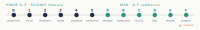
*Figure 13 — Science (frozen) 0–5, then web A–F; every checkpoint is a deliberate stop for human review.*

| Phase | Delivered |
|---|---|
| Science 0–3 | reproducible pipeline + target-fix; deep evaluation; explainability; responsible-AI docs |
| Science 4–5 | product surface (FastAPI/CLI); external validation on Hungarian/VA/Switzerland |
| Web A–B | design system + tokens + safe copy; additive API + reports-summary.json export |
| Web C–D | Next.js foundation + Home; the live /try demo |
| Web E–F | chart pages (/results, /external, /thresholds); /transparency, /about + responsible-AI review |

## 20 · Current state
**Built & verified:** all 7 pages; production build green; model hash unchanged every phase; banned-word scans clean on rendered output; WCAG AA across both themes.
**Pending / next:** deployment handoff docs (owner deploys); real GitHub URL (placeholder now); optional polish (scroll animation on /external, factor-label tidy); optional responsive QA + automated a11y audit.

## 21 · Future roadmap
1. Finish polish (scroll storytelling on /external, factor labels, responsive QA).
2. Accessibility audit (automated + manual) across all seven pages.
3. Deployment handoff — Vercel (frontend) + a container host for FastAPI; CORS via env; **owner enters all secrets**.
4. README + portfolio case-study page linking the live site, repo, and this dossier.
5. Optional — short video walkthrough; downloadable model-card PDF; a full per-threshold sweep added to the reports so /thresholds can draw a real curve.

## 22 · Responsible-use statement
**CardioLens is an educational machine-learning demo on historical public research data.** It shows how a frozen model behaves, where it transfers, and where it fails. It is **not medical advice, not a medical verdict, and not a clinical tool.** Every number comes from the project's frozen research reports; every result is a model score on research data — never a statement about any real person. For any concern about your own health, talk to a qualified clinician.

---

# Appendix A — Metric source map & citations
| Figure / claim | Source file(s) |
|---|---|
| Internal metrics, confusion | `reports/metrics.json` → `web-data/reports-summary.json` |
| Bootstrap confidence intervals | `reports/uncertainty_metrics.json` |
| Model-selection CV table | `reports/cv_results.json` |
| Threshold operating points (0.50, 0.20) | `reports/threshold_test_evaluation.csv` |
| External validation | `reports/external_validation_metrics.csv` |
| Subgroup performance | `reports/subgroup_metrics.csv · reports/model_card.md` |
| Dataset identity & provenance | `reports/data_card.md · data/README.md` |
| Limitations, nested CV, curves | `reports/model_card.md` |
| Brand, copy, tokens, components | `docs/design/*.md · tokens.css · tokens.ts` |
| Architecture & API behaviour | `api/main.py · frontend/ · docs/WEBSITE_PLAN.md` |
| Guardrails & safe-wording rules | `AGENTS.md · CLAUDE.md` |

No external sources were used. Where a numeric series is absent from the frozen artifacts (per-point ROC/PR curves, full threshold sweep, learning-curve points, calibration bins), the site and this dossier render an honest "not in the report snapshot" state rather than inventing data.

# Appendix B — Diagram sources
See `DIAGRAM_SOURCES.md`. All figures were generated programmatically for this dossier from the frozen reports — no external image assets.

---
*CardioLens — educational machine-learning case study. Not medical advice. Generated June 2026. Every number traced to the project's frozen research reports.*
